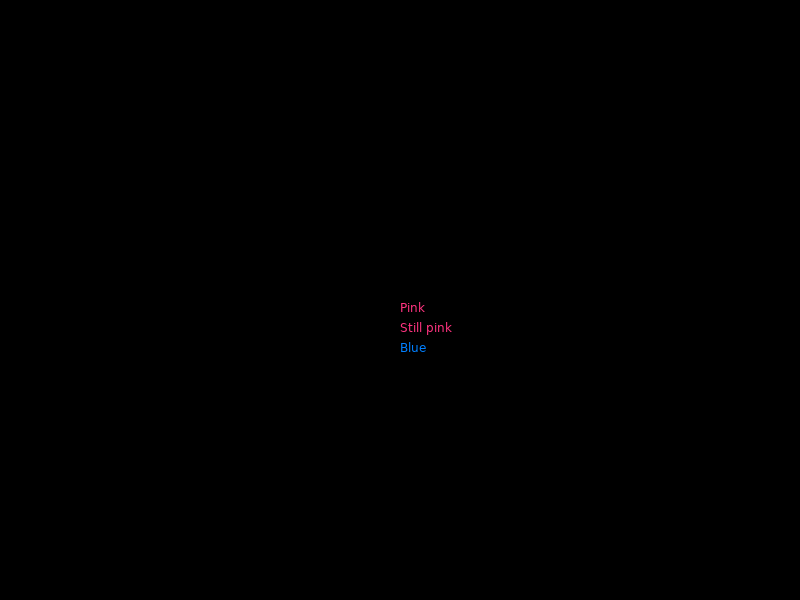
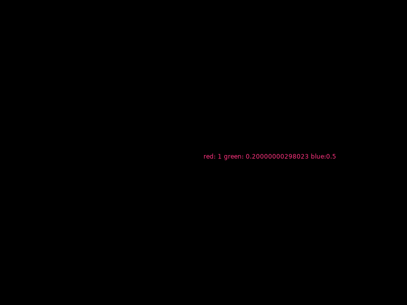
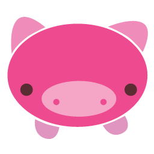
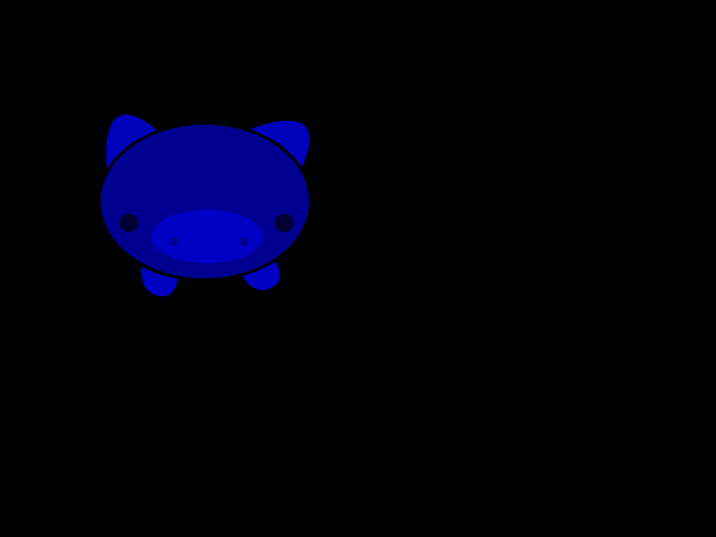
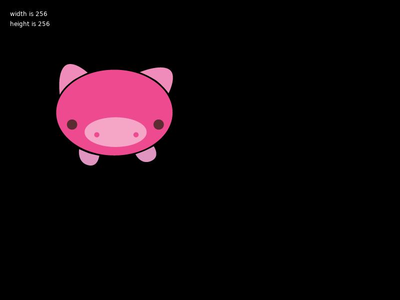
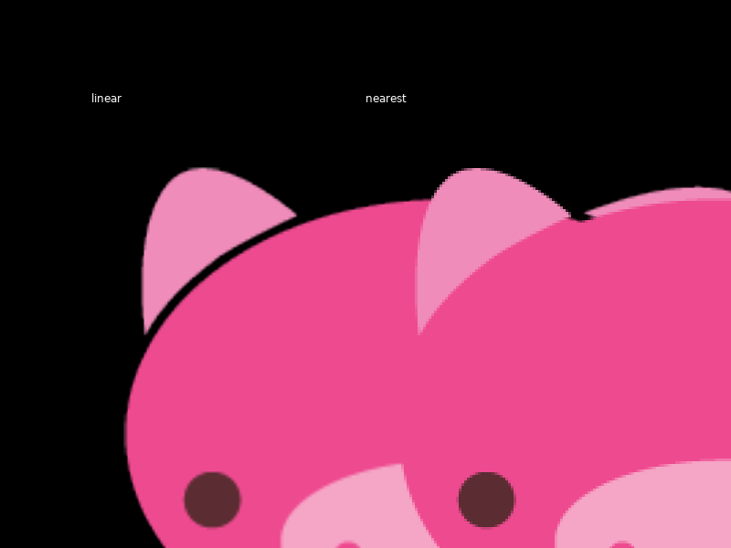
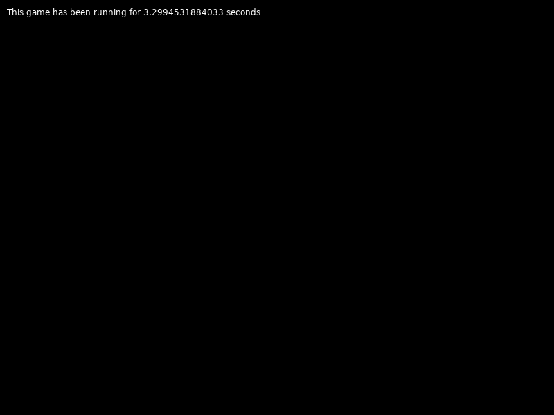
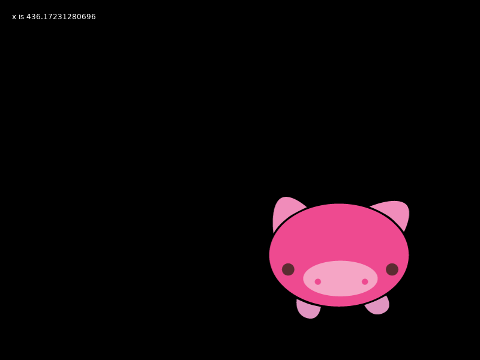
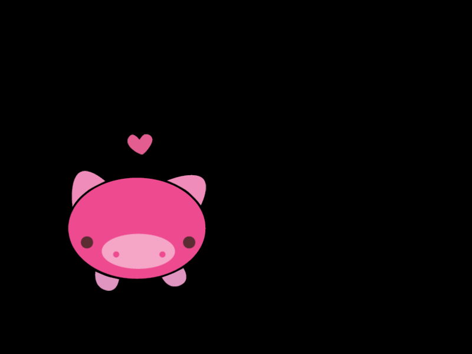
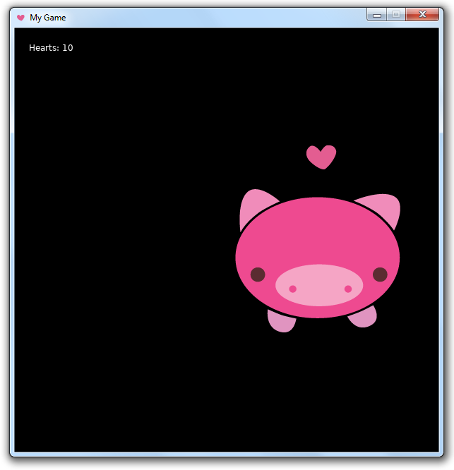

# Introduction to LÖVE

This tutorial is just a draft and isn't very good or complete and you probably shouldn't follow it in its current state. It's needlessly Windows-centric, assumes command-line knowledge, and targets LÖVE 0.11.0 which isn't released and this tutorial will probably be inaccurate when it is released. It might also be misnaming some LÖVE concepts and have lots of other mistakes and inaccuracies.

It's designed to be an introduction to LÖVE and the basic concepts of the LÖVE API in a tutorial format, for someone who has some programming experience but might not have used an API like LÖVE's before. The goal of the tutorial is that after reading it, the reader will be able to make more sense of the API information in the wiki.

### What is LÖVE?

LÖVE is a framework for making 2D games with the Lua programming language. It's free and licensed under the [zlib license](https://en.wikipedia.org/wiki/Zlib_License), which means it can be used freely for commercial purposes with no limitations.

See [LÖVE's homepage](http://love2d.org/) for download links.

Games made with LÖVE can be run on Windows, macOS, Linux, Android and iOS.

For examples of what has been made with LÖVE, see the bottom of [LÖVE's homepage](https://love2d.org/), josefnpat's list of [notable LÖVE games](http://missingsentinelsoftware.com/notable-love-games) and the [games and creations forum](https://love2d.org/forums/viewforum.php?f=14).

LÖVE uses LuaJIT 2.0, but you don't need to install it separately, it's built-in. LÖVE uses SDL, OpenGL and OpenAL Soft behind the scenes, if this means anything to you.

### What LÖVE does

LÖVE provides a way of displaying graphics, playing sounds and getting user input, among other things.

LÖVE generally doesn't provide things which can be written in Lua, unless they would be too slow. For example, LÖVE doesn't provide anything specifically for animations or UI widgets, because these can be made with Lua code that uses what LÖVE provides.

However, there are third-party libraries which can help you do things that LÖVE doesn't provide by default. You can find libraries in [awesome-love2d](https://github.com/love2d-community/awesome-love2d) and the [libraries and tools forum](https://love2d.org/forums/viewforum.php?f=5).

LÖVE does provide some things which benefit performance-wise from not being written in Lua, such as a [Box2D](http://box2d.org/) based physics system, a particle system and some mathematical functions.

### Resources and community

For an IDE which has LÖVE debugging support, check out [ZeroBrane Studio](https://studio.zerobrane.com/). For LÖVE-related plugins for other text editors, see the [IDEs section of awesome-love2d](https://github.com/love2d-community/awesome-love2d#ides).

For questions, there are [the forums](http://love2d.org/forums/), the IRC channel [#love@irc.oftc.net](https://webchat.oftc.net/?channels=love) and a [Discord server](https://discord.gg/rhUets9). Bugs can be reported on [Bitbucket](https://bitbucket.org/rude/love/issues/).

Bitbucket also stores [LÖVE's source code](https://bitbucket.org/rude/love) and [old versions of LÖVE](https://bitbucket.org/rude/love/downloads/). Nightly builds can be found [here](https://love2d.org/builds/).

For LÖVE tutorials, see the [tutorials section of awesome-love2d](https://github.com/love2d-community/awesome-love2d#tutorials).

## Tutorial introducing LÖVE concepts

This is a tutorial that you can follow along with which will introduce key LÖVE concepts.

Install LÖVE via the download links on the [LÖVE homepage](https://love2d.org/).

*Note:* I think the next version of LÖVE might have an option to add the installation directory to the PATH, so I'll assume that the user can run LÖVE by typing "love" in the command line.

Open the command prompt, type *love* and press enter.

This is the no-game screen. You can close it by clicking the window's close button.

Create a folder for your LÖVE project.

Open a text editor of your choice and save an empty file with the name *main.lua* in your project folder.

Navigate to the project folder using the command prompt and type *love .* (that's love-space-dot) and press enter. (The dot means the current directory.)

Instead of the no-game screen, you will see an empty window.

Put the following code in to *main.lua* and save the file.

```lua
function love.draw()
    love.graphics.print("Hello World!", 400, 300)
end
```


Run the project with LÖVE again, and you will see text in the window.

This introduces the *love table*, *callbacks*, *modules*, *functions*, and *drawing*.

`love.draw` is a *callback*. Control flow in LÖVE uses callbacks, which are functions which you create and LÖVE runs at specific times.

`love.draw` is called every frame, and its contents can *draw* to the screen.

`love.graphics.print` is a *function* which draws text to the screen. Its first argument is the text to draw, its second argument is how many pixels from the left of the screen to draw the text, and its third argument is how many pixels from the top.

`love.graphics.print` is in the "graphics" *module*. LÖVE's internal code is divided into modules. Functions in modules are named in the format "`love.module.functionName`", and are in camelCase.

All modules and callbacks are within the *love table*, i.e. they start with "`love.`".

Callbacks aren't in a module table, i.e. they have the format "`love.callbackname`", and are lowercase.

Add this new line and run the project again.

```lua
function love.draw()
    love.graphics.setColor(1, .2, .5)
    love.graphics.print("Hello World!", 400, 300)
end
```


`love.graphics.setColor` is another function. Its arguments are the red, green and blue components of a color, between 0 and 1.

This introduces another concept: *global state*. The color that things are drawn with is global state. As seen previously, the *default state* of color is white. `love.graphics.setColor` above changes the color state to be pink.

The color state will remain the same until it is set to something different.

```lua
function love.draw()
    love.graphics.setColor(1, .2, .5)
    love.graphics.print("Pink", 400, 300)
    love.graphics.print("Still pink", 400, 320)

    love.graphics.setColor(0, .5, 1)
    love.graphics.print("Blue", 400, 340)
end
```



Functions which set state often start with "`set`", and are often accompanied by functions which get state, which often start with "`get`".

```lua
function love.draw()
    love.graphics.setColor(1, .2, .5)

    red, green, blue = love.graphics.getColor()

    love.graphics.print("red: "..red.." green: "..green.." blue:"..blue, 400, 300)
end
```



Save this .png file into your project folder.

(The images used are from LÖVE 0.8.0's no-game screen.)



Replace the code in *main.lua* with this:

```lua
function love.draw()
    image = love.graphics.newImage('pig.png')

    love.graphics.draw(image, 100, 100)
end
```

This introduces the functions `love.graphics.newImage` and `love.graphics.draw`.

It also introduces *objects*, *constructor functions* and the *filesystem*.

`love.graphics.newImage` is a *constructor function*. It creates a new Image *object*.

Constructor functions often start with "`new`".

The image filepath given as an argument to `love.graphics.newImage` is found in LÖVE's *filesystem*. LÖVE's filesystem includes everything in the project folder.

`love.graphics.draw` is a function which draws some types of objects, including Image objects.

The color state also affects drawn images.

```lua
function love.draw()
    image = love.graphics.newImage('pig.png')

    love.graphics.setColor(0, 0, 1)

    love.graphics.draw(image, 100, 100)
end
```



`love.graphics.newImage` can take a little bit longer than most functions because it loads an image from the hard drive, so to increase performance images can be loaded once and then used repeatedly in `love.draw`.

```lua
function love.load()
    image = love.graphics.newImage('pig.png')
end

function love.draw()
    love.graphics.draw(image, 100, 100)
end
```

This introduces the callback `love.load`.

`love.load` is called only once when the game is run, and before `love.draw` is called.

The following example introduces *methods*.

```lua
function love.load()
    image = love.graphics.newImage('pig.png')

    width = image:getWidth()
    height = image:getHeight()
end

function love.draw()
    love.graphics.draw(image, 100, 100)

    love.graphics.print('width is '..width, 20, 20)
    love.graphics.print('height is '..height, 20, 40)
end
```



Objects can have functions which relate to that particular object, called *methods*. `getWidth` and `getHeight` are Image methods which return the width and height of that particular Image.

`love.graphics.draw` has more arguments than have been used so far. The arguments that aren't given have *default values*.

The argument after the x/y position arguments is the drawn image's angle (in radians). It defaults to 0.

```lua
function love.load()
    image = love.graphics.newImage('pig.png')
end

function love.draw()
    love.graphics.draw(image, 100, 100, 0.5)
end
```


The next argument is the scaling factor, which changes the size of the drawn image.

```lua
function love.load()
    image = love.graphics.newImage('pig.png')
end

function love.draw()
    love.graphics.draw(image, 100, 100, 0, 3)
end
```


Whether the image looks smoothed or pixelated when scaled can be changed by the `setFilter` Image function.

```lua
function love.load()
    image1 = love.graphics.newImage('pig.png')	
    image1:setFilter('linear')
	
    image2 = love.graphics.newImage('pig.png')
    image2:setFilter('nearest')
end

function love.draw()
    love.graphics.print(image1:getFilter(), 100, 100)
    love.graphics.draw(image1, 100, 100, 0, 3)
	
    love.graphics.print(image2:getFilter(), 400, 100)
    love.graphics.draw(image2, 400, 100, 0, 3)
end
```



This introduces *object state*. Like the color state, the Image's filter has set/get methods.

Replace the code with this:

```lua
function love.load()
    timer = 0
end

function love.update(dt)
    timer = timer + dt
end

function love.draw()
    love.graphics.print('This game has been running for '..timer..' seconds', 10, 10)
end
```



This introduces the callback `love.update`.

`love.update` is called every frame, just before `love.draw`.

`love.update` has an argument, often named *dt*. *dt* stands for "delta time" and is the time since `love.update` was last run.

*dt* can be used to change a number steadily over time regardless of framerate.

```lua
function love.load()
    image = love.graphics.newImage('pig.png')

    x = 0
end

function love.update(dt)
    x = x + (100 * dt)
end

function love.draw()
    love.graphics.draw(image, x, 300)

    love.graphics.print('x is '..x, 20, 20)
end
```



The code above draws an image at an X position which increases by 100 pixels per second.

Instead of moving the image to the right all of the time, the code can be changed so that the image only moves when the right arrow key is held down.

```lua
function love.load()
    image = love.graphics.newImage('pig.png')

    x = 0
end

function love.update(dt)
    if love.keyboard.isDown('right') then
        x = x + (100 * dt)
    end
end

function love.draw()
    love.graphics.draw(image, x, 300)

    love.graphics.print('x is '..x, 20, 20)
end
```

This introduces the function `love.keyboard.isDown`. Note that it is in the "keyboard" module.

This function returns a single boolean value which *true* if the key given to it is currently being held down or *false* if not.

Functions which return a single boolean value often start with "`is`" or "`are`" or "`has`".

The code can be changed so that the other arrow keys can move the image as well.

```lua
function love.load()
    image = love.graphics.newImage('pig.png')

    x = 300
    y = 200
end

function love.update(dt)
    if love.keyboard.isDown('right') then
        x = x + (100 * dt)
    end

    if love.keyboard.isDown('left') then
        x = x - (100 * dt)
    end

    if love.keyboard.isDown('down') then
        y = y + (100 * dt)
    end

    if love.keyboard.isDown('up') then
        y = y - (100 * dt)
    end
end

function love.draw()
    love.graphics.draw(image, x, y)

    love.graphics.print('x is '..x, 20, 20)
    love.graphics.print('y is '..y, 20, 40)
end
```

There are also callbacks for input. The following code moves the heart above the pig when the space bar is pressed.

Save this .png file into your project folder.


```lua
function love.load()
    image = love.graphics.newImage('pig.png')

    x = 300
    y = 200

    heart = love.graphics.newImage('heart.png')

    heartX = x + 100
    heartY = y - 50
end

function love.update(dt)
    -- Same as before
end

function love.draw()
    love.graphics.draw(image, x, y)

    love.graphics.draw(heart, heartX, heartY)
end

function love.keypressed(key)
    if key == 'space' then
        heartX = x + 100
        heartY = y - 50
    end
end
```



`love.keypressed` is a callback which is called when a key is pressed. It has an argument which is the key that was pressed.

Save this sound file into your project folder: [sound.ogg](sound.ogg)

In the following code, the sound plays when a key is pressed.

```lua
function love.load()
    -- Same as before, plus...

    source = love.audio.newSource('sound.ogg', 'static')
end

function love.update(dt)
    -- Same as before
end

function love.draw()
    -- Same as before
end

function love.keypressed(key)
    if key == 'space' then
        heartX = x + 100
        heartY = y - 50

        source:stop()
        source:play()
    end
end
```

This introduces Source objects and the Source methods `play` and `stop`.

A Source is an object which has a sound which it can play. When the sound is stopped, calling its `play` function stars the sound playing. When the sound is playing, callings its `play` function does nothing, so to start the sound again it is stopped and then played.

This example also introduces *enums*.

The second argument to `love.audio.newSource` is how the sound file is loaded. If the second argument is "static", the sound file is decoded (or "decompressed") into memory. If the second argument is "stream", the sound file is loaded into memory but only decoded when it is played, saving memory but decreasing performance.

"static" and "stream" are *constants* of the Source type *enum*. An enum in LÖVE is a set of possible string constants which can be given to functions to specify different modes of operation.

The next example keeps track of how many times the space bar is pressed.

```lua
function love.load()
    -- Same as before, plus...

    hearts = 0
end

function love.update(dt)
    -- Same as before
end

function love.draw()
    -- Same as before, plus...

    love.graphics.print('Hearts: '..hearts, 20, 20)
end

function love.keypressed(key)
    if key == 'space' then
        -- Same as before, plus...

        hearts = hearts + 1
    end
end
```


When the game is closed and restarted the number goes back to 0.

To keep the number going even if the game is restarted, it can be saved to a file.

```lua
function love.load()
    image = love.graphics.newImage('pig.png')

    x = 300
    y = 200

    heart = love.graphics.newImage('heart.png')

    heartX = x + 100
    heartY = y - 50

    source = love.audio.newSource('sound.ogg', 'static')

    if love.filesystem.getInfo('hearts.txt') then
        contents = love.filesystem.read('hearts.txt')
        hearts = tonumber(contents)
    else
        hearts = 0
    end
end

function love.update(dt)
    -- Same as before
end

function love.draw()
    -- Same as before
end

function love.keypressed(key)
    if key == 'space' then
        -- Same as before, plus...

        love.filesystem.write('hearts.txt', hearts)
    end
end
```

This introduces the functions *love.filesystem.getInfo*, *love.filesystem.read* and *love.filesystem.write*.

It also introduces the *save directory*.

When a key is pressed, the number of hearts is saved in a file in the save directory.

The save directory on Windows is "C:\Users\user\AppData\Roaming\LOVE\projectname"

`love.filesystem.write` takes the file to write to and the string to write to it as arguments.

When the game is loaded, the save file is checked to see if it exists yet with `love.filesystem.getInfo`. If it does, the contents of the file are read to a string with `love.filesystem.read`.

The save directory is the only folder that LÖVE can write to.

Both the save directory and the project folder can be read from. When a file path is given to `love.filesystem.read` or `love.graphics.newImage` for example, it is looked for in both the save directory and the project folder.

Create a new file in the project folder named *conf.lua* containing the following code:

`
function love.conf(t)
    t.window.width = 600
    t.window.height = 600
    t.window.icon = 'heart.png'
	t.window.title = 'My Game'
end
`



The window is now a square, window icon is a heart and the window title is "My Game".

This introduces *conf.lua* and *love.conf*.

If it exists, *conf.lua* is run before *main.lua*. These two files are the only files LÖVE runs by default.

*love.conf* is a callback which only works when made in *conf.lua*.

It is given a table as an argument which has keys for different settings which can be changed.

## Distribution

### .love files

A *.love* file is the contents of a project in a .zip file, just with a differently named file extension.

*.love* files open with LÖVE by default when LÖVE is installed.

To zip a LÖVE project on Windows, select all of the files within the project folder (not the folder itself), right click and select *Sent to > Compressed (zipped) folder*.

Rename the file extension from *.zip* to *.love*.

If the file extension is not visible, either make file extensions visible by typing "show ext" into the Start menu search box and opening "*Show or hide file extensions*", then unchecking "*Hide extensions for known file types*" and clicking OK.

Alternatively, the zip file can be renamed from the command line: *ren example.zip example.love*

### Making an exe

The command to create an .exe file is "copy /b path_to_love.exe+path_to_project.zip output.exe" (the LÖVE project can have either a .zip or .love file extension). For example:

`
copy /b "C:\Program Files\LÖVE\love.exe"+example.love example.exe
`

The .dll files from the LÖVE directory have to be copied into the same directory as the new .exe file for it to work, and license.txt has to be copied too for legal reasons (is this correct?).

When the game is made into an .exe it is said to be "fused". When a game is fused, its save directory is now directly in the appdata directory instead of in the "LOVE" subdirectory, i.e. "C:\Users\user\AppData\Roaming\projectname" instead of "C:\Users\user\AppData\Roaming\LOVE\projectname".

[Resource Hacker](http://www.angusj.com/resourcehacker/) can be used to change the icon and the version info of the .exe file.

[love-release](https://github.com/MisterDA/love-release) is a tool to help make automated releases for multiple platforms.
